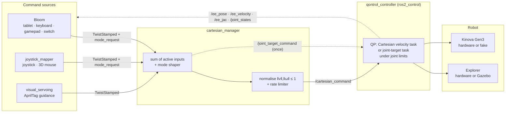

<h1 align="center">ISIR-EXTENDER</h1>

<p align="center">
  <strong>Assistive robot arms, controlled from a tablet, built as an open ROS 2 stack.</strong><br />
  Institut des Systèmes Intelligents et de Robotique · Sorbonne Université / CNRS · Paris
</p>

<p align="center">
  <a href="https://github.com/ISIR-EXTENDER/bloom"></a>
</p>

<p align="center">
  
  
  
  
  
  
  
</p>

<p align="center">
  <a href="#start-here">Start Here</a> ·
  <a href="#how-the-stack-fits-together">Architecture</a> ·
  <a href="#repositories">Repositories</a> ·
  <a href="#robots">Robots</a> ·
  <a href="#bloom-the-operator-interface">Bloom</a> ·
  <a href="#quick-start">Quick Start</a> ·
  <a href="#command-contract">Command Contract</a> ·
  <a href="#whats-new">What's New</a> ·
  <a href="#team">Team</a> ·
  <a href="#contributing">Contributing</a> ·
  <a href="#licensing">Licensing</a> ·
  <a href="#research-and-credits">Credits</a>
</p>

Extender is a research stack for **assistive manipulation**: a person with limited
mobility drives a robot arm from a tablet, a joystick, or an assistive switch, and
the arm helps with everyday tasks. The same code runs on the Orthopus **Explorer**
arm and on a **Kinova Gen3**, in simulation or on hardware.

The stack has three layers, each in its own repository, each replaceable:

| Layer | What it does | Repository |
| --- | --- | --- |
| **Operator interface** | Builds accessible web screens and runs them in a kiosk with a latched STOP. | [`bloom`](https://github.com/ISIR-EXTENDER/bloom) |
| **Command manager** | Sums every active Cartesian input, applies the selected mode, keeps the output bounded. | [`cartesian_manager`](https://github.com/ISIR-EXTENDER/cartesian_manager) |
| **QP controller** | Turns the Cartesian command into joint motion under joint limits, using the Qontrol QP solver. | [`qontrol_controller`](https://github.com/ISIR-EXTENDER/qontrol_controller) |

> [!NOTE]
> **September 2026.** The stack moved to Ubuntu 24.04 and ROS 2 Jazzy, the
> control path moved to `cartesian_manager` → `qontrol_controller`, and
> **Bloom replaced `extender_ui`** as the operator interface. The retired
> path is tagged and kept readable; see [Legacy](#legacy-paths).

## Start Here

| I want to… | Go to |
| --- | --- |
| Set up a development machine | [`extender_workspace`](https://github.com/ISIR-EXTENDER/extender_workspace) · [Quick Start](#quick-start) |
| Drive a simulated arm in ten minutes | [Bloom · Getting started](https://github.com/ISIR-EXTENDER/bloom/blob/main/docs/tutorials/getting-started.md) |
| Build an operator screen or an accessible input profile | [`bloom`](https://github.com/ISIR-EXTENDER/bloom) · [Build your first app](https://github.com/ISIR-EXTENDER/bloom/blob/main/docs/tutorials/build-your-first-app.md) |
| Add a control mode, a shaper, or a named pose | [`cartesian_manager`](https://github.com/ISIR-EXTENDER/cartesian_manager) |
| Change how the arm executes commands, add a QP task or constraint | [`qontrol_controller`](https://github.com/ISIR-EXTENDER/qontrol_controller) (branch `topic/isir_manager`) |
| Map a new joystick or 3D mouse | [`input_interfaces/joystick_mapper`](https://github.com/ISIR-EXTENDER/input_interfaces/tree/main/joystick_mapper) |
| Work on AprilTag detection or visual servoing | [`tools/apriltag_detector`](https://github.com/ISIR-EXTENDER/tools/tree/main/apriltag_detector) · [`input_interfaces/visual_servoing`](https://github.com/ISIR-EXTENDER/input_interfaces/tree/main/visual_servoing) |
| Run the Petanque demonstrator | [`apps-petanque`](https://github.com/ISIR-EXTENDER/apps-petanque) · Bloom's Petanque app |
| Report a bug in the operator interface | [Bloom issues](https://github.com/ISIR-EXTENDER/bloom/issues) |

## How The Stack Fits Together



Three rules keep the layers honest:

- **Inputs are summed, not arbitrated.** Every active source publishes a unit-scale
  `geometry_msgs/msg/TwistStamped`; the manager adds them, so a joystick and a
  visual-servoing loop can act together. An input that stops streaming for
  0.2 s drops out of the sum.
- **Control authority stays in the QP.** `cartesian_manager` never moves a joint
  itself. A named pose such as `behaviour/joint_target/home` is published once
  as a `sensor_msgs/msg/JointState`; `qontrol_controller` turns the joint error
  into a bounded joint-velocity task, so joint limits and constraints stay active
  while homing. The manager then returns to passthrough on its own.
- **ROS stays at the adapter boundary.** Bloom's frontend never imports ROS. Its
  FastAPI backend validates, rate-limits and audits every command, and one
  runtime session owns the arm at a time while STOP stays available to everyone.

The only code adopted from the robot vendors is the **robot description**:
Explorer's URDF, hardware interface and Gazebo model come from
[ORTHOPUS-EXPLORER/explorer_stack](https://github.com/ORTHOPUS-EXPLORER/explorer_stack),
and the Kinova description from `ros2_kortex`. Their own command paths are not
used.

## Repositories

### Active

| Repository | Role | Owner | License |
| --- | --- | --- | --- |
| [`extender_workspace`](https://github.com/ISIR-EXTENDER/extender_workspace) | Entry point: `extender.repos` manifest, `setup_workspace.sh`, shared `uv` Python environment, build guide, Jazzy migration notes. | Susana, Mégane | Not declared |
| [`bloom`](https://github.com/ISIR-EXTENDER/bloom) | Operator interface: visual Builder, kiosk Runtime, accessible input profiles, FastAPI backend, ROS adapters, Explorer and Kinova Manager apps. | Susana | MIT |
| [`cartesian_manager`](https://github.com/ISIR-EXTENDER/cartesian_manager) | Manager between command sources and the controller: input summing, `both` / `jaco` / `snake` shapers, named joint targets, normalisation, rate limiting. | Mégane | Not declared |
| [`qontrol_controller`](https://github.com/ISIR-EXTENDER/qontrol_controller) | `ros2_control` controller on the INRIA [Qontrol](https://auctus-team.gitlabpages.inria.fr/components/control/qontrol/index.html) QP solver and Pinocchio. The workspace builds branch `topic/isir_manager`. Private. | Esteban Cosserat, Mégane | GPL-3.0 |
| [`input_interfaces`](https://github.com/ISIR-EXTENDER/input_interfaces) | `joystick_mapper` (joystick and 3D mouse to twist and mode requests), `visual_servoing` (AprilTag-guided twist), `camera_interface` (gripper camera bringup). | Mégane, Robin, Susana | MIT |
| [`tools`](https://github.com/ISIR-EXTENDER/tools) | `apriltag_detector`, `extender_msgs`, `hub` (Arduino I/O bridge), `signal_processing`, `mediapipe_mocap`, `offline_media_publisher`, `dynamic_parameters_identification`. | Susana, Mégane, Etienne, Robin | MIT |
| [`apps-petanque`](https://github.com/ISIR-EXTENDER/apps-petanque) | Petanque demonstrator: bringup, messages, state machine, trajectories. Rebased onto `cartesian_manager` in September 2026. Private. | Team | Not declared |

### Robot descriptions (external, imported by the workspace)

| Repository | Branch | Used for |
| --- | --- | --- |
| [ORTHOPUS-EXPLORER/explorer_stack](https://github.com/ORTHOPUS-EXPLORER/explorer_stack) | `develop` | Explorer description, hardware interface, VESC/CAN drivers, Gazebo simulation, `explorer_input_devices`. |
| [Kinovarobotics/ros2_kortex](https://github.com/Kinovarobotics/ros2_kortex) | `jazzy` | `kortex_description` for the Gen3 URDF. Imported only with `WITH_KORTEX=1`. |
| [PickNikRobotics/ros2_robotiq_gripper](https://github.com/PickNikRobotics/ros2_robotiq_gripper) | `main` | `robotiq_description` for the 2F-85 gripper the Gen3 URDF includes. |

### Legacy paths

Kept readable and buildable for the record and for rollback. Do not start new
work here.

| Repository | Status | Last supported reference |
| --- | --- | --- |
| [`extender_ui`](https://github.com/ISIR-EXTENDER/extender_ui) | Retired React tablet app, replaced by Bloom. | tag `v1.0.0` |
| [`input_interfaces/tablet_interface`](https://github.com/ISIR-EXTENDER/input_interfaces/tree/main/tablet_interface) | Retired websocket backend of `extender_ui`. The other packages in that repository are current. | tag `tablet_interface/v1.0.0` |
| [`sandbox_controller`](https://github.com/ISIR-EXTENDER/sandbox_controller) | Previous reference controller on the `/teleop_cmd` contract. | `main` |
| [`controllers`](https://github.com/ISIR-EXTENDER/controllers) · [`robot_interfaces`](https://github.com/ISIR-EXTENDER/robot_interfaces) | Previous controller plugins (Cartesian velocity, joint interpolation, kinematic guides, snake demo) and their robot abstraction layer. Marked `COLCON_IGNORE` in the workspace. | `main` |
| [`ISIR-EXTENDER/explorer_stack`](https://github.com/ISIR-EXTENDER/explorer_stack) | Humble-era fork of the Explorer stack. The workspace now imports ORTHOPUS `develop` directly. | `dev/ts/mode_0` |

## Robots

| Robot | Role | Simulation | Bringup |
| --- | --- | --- | --- |
| **Orthopus Explorer** | Main demonstrator. Custom assistive arm, CAN/VESC actuators, no slip ring, so continuous wrist rotation is a hard constraint. | Gazebo, from `explorer_stack` | `ros2 launch cartesian_manager explorer.launch.py use_simulation:=true` |
| **Kinova Gen3** | Lab reference arm for the same controllers without Explorer's hardware constraints. Robotiq 2F-85 gripper. | `ros2_control` fake hardware | `ros2 launch cartesian_manager kinova.launch.py use_simulation:=true gui:=false` |

Both launch files bring up the robot base, `qontrol_controller`, the gripper
controller, `cartesian_manager_node`, `joy_node` and `joystick_mapper`. The
per-robot differences live in `cartesian_manager/bringup/config/*_params.yaml`
and in the controller YAML, not in duplicated code. Bloom ships an **Explorer
Manager** and a **Kinova Manager** app on top of the same screens.

The Franka FR3 was supported by the legacy `controllers` path and has not been
ported to `cartesian_manager`.

## Bloom, The Operator Interface

[Bloom](https://github.com/ISIR-EXTENDER/bloom) builds accessible web interfaces
for robots and runs them in a focused kiosk. Compose screens in the **Builder**,
open the saved app as a role on a tablet or desktop, and reach the robot through
a policy-checked backend.

| Builder | Explorer Manager | Kinova Manager |
| --- | --- | --- |
|  |  |  |

What ships today:

- **Builder and kiosk Runtime** for shared application, screen, widget, theme,
  profile and guardrail models. Builder and Runtime render the same screen model.
- **Touch, keyboard and gamepad** Cartesian input composed into one 6-DoF command,
  streamed at 30 Hz with neutral commands sent immediately on release.
- **Accessible profiles**: single-switch scan-step and scan-plus-dwell
  teleoperation (awaiting validation with the target devices), and English,
  Spanish and French runtime shells.
- **Safety in the backend**: allowlists, rate limits, validation, audit log, one
  command owner per session, and a **latched STOP** every operator can press.
- **ROS 2 adapters** for `cartesian_manager`, generic topic publishing, service
  calls, topic discovery, and a camera path on its own socket.
- **Explorer and Kinova Manager** workflows: Joystick Lab, Drive, Positions,
  Robot feedback, Command sources, plus a read-only Supervisor mirror and
  Bloom Debug with live joint states and the Jacobian.
- **CI that runs against the simulations**: `npm run e2e:sim` drives the
  Explorer and Kinova sims and checks each effect on the ROS graph.

The [five-minute walkthrough](https://github.com/ISIR-EXTENDER/bloom/blob/main/docs/assets/demo/bloom-demo.mp4)
creates an app, drives the arm, sends it home, switches frames, latches STOP and
reads the Jacobian. Nothing is mocked.

> [!CAUTION]
> Start with simulation or fake hardware. Bloom's STOP latches the software
> command path; it does not replace the robot's hardware emergency stop,
> controller limits, or the lab safety procedure.

## Quick Start

### 1. Workspace

Ubuntu 24.04 and ROS 2 Jazzy are the baseline. Ubuntu 22.04 with ROS 2 Humble is
retired; the workspace README has an
[upgrade note](https://github.com/ISIR-EXTENDER/extender_workspace#upgrading-from-humble).

```bash
sudo apt install -y build-essential cmake git pkg-config \
  python3-colcon-common-extensions python3-rosdep python3-vcstool libeigen3-dev \
  ros-jazzy-cv-bridge ros-jazzy-image-transport ros-jazzy-apriltag ros-jazzy-apriltag-ros ros-jazzy-usb-cam

mkdir -p ~/workspace/extender && cd ~/workspace/extender
git clone https://github.com/ISIR-EXTENDER/extender_workspace.git
cd extender_workspace

bash setup_workspace.sh              # add WITH_KORTEX=1 for the Kinova stack
uv sync --extra ros-build --extra dev

source /opt/ros/jazzy/setup.bash
rosdep install --from-paths src --ignore-src -r -y
colcon build --symlink-install --packages-up-to cartesian_manager
source install/setup.bash
colcon build --symlink-install
```

### 2. A moving arm

```bash
source install/setup.bash
ros2 launch cartesian_manager explorer.launch.py use_simulation:=true
# or
ros2 launch cartesian_manager kinova.launch.py use_simulation:=true gui:=false
```

Then send a mode request or a named pose:

```bash
ros2 topic pub --once /mode_request std_msgs/msg/String "{data: 'geometric/snake'}"
ros2 topic pub --once /mode_request std_msgs/msg/String "{data: 'behaviour/joint_target/home'}"
```

### 3. Bloom

Bloom needs Node.js 24 LTS, npm 11+, Python 3.10 to 3.12 and `uv`. Clone it next
to the workspace:

```bash
git clone https://github.com/ISIR-EXTENDER/bloom.git
cd bloom && npm install && (cd backend && uv sync)

# terminal 1: ROS-enabled API
source /opt/ros/jazzy/setup.bash
source ../extender_workspace/install/setup.bash
cd backend && make ros-run

# terminal 2: dashboard
npm run dev
```

Open <http://127.0.0.1:5173>, choose **Runtime**, then **Explorer Manager** or
**Kinova Manager**. The full path from clone to a moving arm is in
[Getting started](https://github.com/ISIR-EXTENDER/bloom/blob/main/docs/tutorials/getting-started.md);
[Operate safely](https://github.com/ISIR-EXTENDER/bloom/blob/main/docs/tutorials/operate-safely.md)
is the operator's page.

<details>
<summary>Known Jazzy caveats</summary>

- `cartesian_manager` installs a `docs` directory that is not committed upstream.
  Create it empty before a clean build.
- Explorer simulation on Jazzy needs two upstream workarounds, documented in the
  [workspace README](https://github.com/ISIR-EXTENDER/extender_workspace#explorer-simulation-on-jazzy):
  stop the standalone `ros2_control_node` once it waits for `robot_description`,
  and bridge the Gazebo clock with `ros_gz_bridge`.
- Machines using Kitware's CMake 4.x need
  `--cmake-args -DCMAKE_POLICY_VERSION_MINIMUM=3.5` on every build.
- For the Kinova, `kortex_description` must come from the `jazzy` branch
  (0.2.6); 0.2.3 and the apt `robotiq_description` fail under Jazzy's
  `ros2_control`.

</details>

## Command Contract

Everything above the controller speaks this contract. Defaults come from
`cartesian_manager/bringup/config/explorer_params.yaml`.

| Topic | Type | Direction | Meaning |
| --- | --- | --- | --- |
| `/joystick_cartesian_command` | `geometry_msgs/msg/TwistStamped` | in | Joystick, tablet or gamepad twist, unit scale. |
| `/visual_servoing_cartesian_command` | `geometry_msgs/msg/TwistStamped` | in | Visual-servoing twist. |
| `/mode_request` | `std_msgs/msg/String` | in | Mode or behaviour selection. |
| `/cartesian_command` | `geometry_msgs/msg/TwistStamped` | out | Shaped, bounded twist to the QP. |
| `/joint_target_command` | `sensor_msgs/msg/JointState` | out | Named joint target, published once. Empty message cancels. |
| `/ee_pose` · `/ee_velocity` · `/ee_jac` · `/joint_states` | `PoseStamped` · `TwistStamped` · `Float64MultiArray` · `JointState` | feedback | Published by `qontrol_controller`. |

**Modes** are lowercase, `-` becomes `_`, British spelling `behaviour`:

| Request | Effect |
| --- | --- |
| `geometric/both` | Passthrough of the summed twist. Default. |
| `geometric/jaco` | Keeps the translation and replaces the rotation with a yaw rate that keeps the tool facing the base as it moves around it. |
| `geometric/snake` | Adds `gain × (z_tool × v)` to the rotation so the tool axis bends into the direction of travel, like a snake's head. |
| `behaviour/passthrough` | Default behaviour; also cancels an in-flight joint target. |
| `behaviour/joint_target/<name>` | Move to a named pose from the config, once, then return to passthrough. |

**Frames.** `header.frame_id` selects the frame the rotation part is read in:
`base_link` is summed directly, `effector_frame` is rotated into base with the
live `/ee_pose`, `hybrid_frame` uses the manager's hybrid pose. Empty falls back
to `base_link`. There is no TF lookup. The manager normalises output to unit
scale; `command_max_linear_velocity` and `command_max_angular_velocity` in the
controller set the real speed.

**Named poses** are captured from the robot, not typed by hand:

```bash
python3 scripts/capture_joint_target.py boire --merge
```

## What's New

Snapshot of default branches, refreshed on **2026-09-24**.

| Repository | Latest activity |
| --- | --- |
| [`bloom`](https://github.com/ISIR-EXTENDER/bloom) | `0ca427f` · point the command preset library at the current stack (after v0.2.0) |
| [`extender_ui`](https://github.com/ISIR-EXTENDER/extender_ui) | `fc59d68` · mark extender_ui legacy in favour of Bloom (#34) |
| [`input_interfaces`](https://github.com/ISIR-EXTENDER/input_interfaces) | `44296f6` · end tablet_interface support |
| [`extender_workspace`](https://github.com/ISIR-EXTENDER/extender_workspace) | `3d3c235` · make the Kinova stack optional (#9) |
| [`cartesian_manager`](https://github.com/ISIR-EXTENDER/cartesian_manager) | `d9a1fa5` · lambda-to-method fix (#9), hybrid frame and rate limiter earlier in September |
| [`tools`](https://github.com/ISIR-EXTENDER/tools) | `a612737` · apriltag_detector on ROS 2 Jazzy (#11) |
| [`controllers`](https://github.com/ISIR-EXTENDER/controllers) | `99fcbdb` · snake demo controller (legacy path) |
| [`apps-petanque`](https://github.com/ISIR-EXTENDER/apps-petanque) | Rebased onto `cartesian_manager` through Bloom's Petanque app, 2026-09-23 |

Active directions:

| Area | Status |
| --- | --- |
| Bloom on the target tablets and robots | Simulations are covered by `npm run e2e:sim`; hardware acceptance, assistive devices and native-speaker checks are open. |
| Tablet layouts | 1024×600 collapse layouts, paired desktop apps and the save-a-pose flow are in the [UX design handoff](https://github.com/ISIR-EXTENDER/bloom/blob/main/docs/ux-design-handoff.md). |
| Control modes | `translation` and `orientation` shapers are planned next to `snake`; snake versus a hybrid mode is under comparison. |
| Safety zones | Qontrol implements Cartesian plane constraints; wiring them into `qontrol_controller` is the prerequisite before Bloom can expose them. |
| Explorer impedance | Available in `explorer_stack` at the joint level; a Cartesian impedance branch in the manager is not started. |
| Visual servoing | Driven from Bloom on the new architecture; `apriltag_detector` and `visual_servoing` both build on Jazzy. |

> This dashboard is a manual snapshot. Check each repository for live history
> before starting integration work.

## Team

| Name | GitHub | Works on |
| --- | --- | --- |
| Susana Sanchez Restrepo | [`@ssrpo`](https://github.com/ssrpo) · [suziesr.xyz](https://suziesr.xyz/) | Bloom, workspace, `apriltag_detector`, this profile. Organisation maintainer. |
| Mégane Millan | [`@MegMll`](https://github.com/MegMll) | `cartesian_manager`, `joystick_mapper`, `qontrol_controller` integration, `extender.repos`. Organisation maintainer. |
| Etienne Moullet | [`@emoullet`](https://github.com/emoullet) | `signal_processing`, `mediapipe_mocap`. |
| Walid Oubraim | [`@woubraim`](https://github.com/woubraim) | `cartesian_manager` contributions. |
| `technodroide` | [`@technodroide`](https://github.com/technodroide) | `tools`, `input_interfaces`, `cartesian_manager` contributions. |

Ask a maintainer for organisation access. Most work needs `extender_workspace`,
`cartesian_manager`, `input_interfaces`, `tools` and `bloom`; controller work
also needs `qontrol_controller`, and the demonstrator needs `apps-petanque`.

## Contributing

Repositories are kept easy to review, easy to test, and safe to integrate
during robot weeks. A repository README may add stricter local rules.

<details>
<summary>Branches, commits and pull requests</summary>

- Branch from an up-to-date `main` with a short name: `feat/joystick-lab-frames`,
  `fix/rate-limiter-reset`, `docs/workspace-onboarding`.
- Commit messages follow [Conventional Commits](https://www.conventionalcommits.org/):
  `feat(cartesian_manager): add hybrid frame`, imperative, lowercase, no period.
- Open a draft PR early. Keep each PR to one logical change and say what changed,
  why, how it was tested, and which robot or simulation assumptions it makes.
- Squash-merge with the PR number in the subject.

</details>

<details>
<summary>Code, documentation and dependencies</summary>

- Write READMEs, comments, PR descriptions and shared docs in English.
- Update the README when adding a topic, a mode, a launch flow, a dependency,
  a widget, or a behaviour an operator must understand. Include commands,
  expected URLs and common failure modes.
- Keep robot-specific values in configuration, not in duplicated code.
- Do not add a ROS message type when a generic message or a typed payload works.
- Workspace Python dependencies live in `extender_workspace/pyproject.toml`;
  commit `pyproject.toml` and `uv.lock` together. Frontend changes commit
  `package.json` with its lockfile.
- Never commit `build*`, `install*`, `log*`, `.venv/`, `node_modules/`, rosbags,
  camera dumps or machine-specific files.

</details>

<details>
<summary>Validation</summary>

```bash
git diff --check
uv lock --locked
colcon build --symlink-install --packages-select <package>
```

Bloom runs everything CI runs with one command, and warns when the working tree
is dirty:

```bash
npm run verify
npm run e2e:sim -- --robot explorer   # or kinova
```

Include screenshots for UI changes that affect layout or operator workflow.

</details>

<details>
<summary>Robot safety</summary>

- Treat every robot-facing change as safety-sensitive. Make scaling, mode
  changes, enable/disable behaviour and topic names explicit in code and docs.
- Validate in simulation or fake hardware before touching an arm.
- Keep operator state visible: active mode, effective frame, stale topics,
  gripper state, STOP state.
- Explorer has no slip ring and runs a QP with hard joint limits. Do not carry
  Kinova assumptions about free rotation onto it.

</details>

## Licensing

| License | Repositories |
| --- | --- |
| MIT | `bloom`, `input_interfaces`, `tools`, `controllers`, `robot_interfaces`, `sandbox_controller` |
| GPL-3.0 | `qontrol_controller` |
| Not declared | `extender_workspace`, `cartesian_manager`, `extender_ui`, `apps-petanque`, `explorer_stack` fork |

Add an explicit `LICENSE` file before reusing or packaging an undeclared
repository outside the project, and check each repository's current file before
integrating with external code. The external descriptions keep their own
licenses: ORTHOPUS `explorer_stack`, Kinova `ros2_kortex`, PickNik
`ros2_robotiq_gripper`.

## Research And Credits

- **Lab**: [Institut des Systèmes Intelligents et de Robotique](https://www.isir.upmc.fr/)
  (ISIR), Sorbonne Université / CNRS, Paris.
- **Project**: ANR DEFI TRANSFERT project Extender, developed with
  [Orthopus](https://github.com/ORTHOPUS-EXPLORER).
- **Demonstrator**: PEPR Robotics Petanque assistive robotics demonstrator.
- **Control**: the [Qontrol](https://auctus-team.gitlabpages.inria.fr/components/control/qontrol/index.html)
  QP library from the INRIA Auctus team, and
  [Pinocchio](https://stack-of-tasks.github.io/pinocchio/) for robot models.
- **Robots**: Explorer by Orthopus; Kinova Gen3 with the Robotiq 2F-85 gripper.
