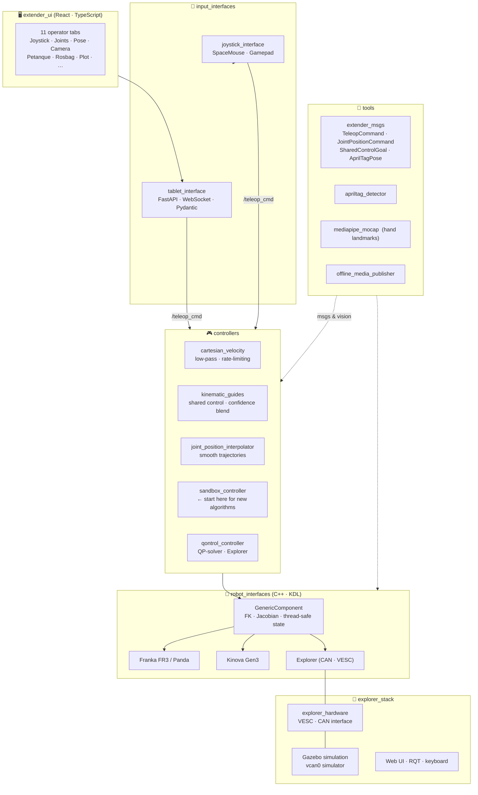

# ISIR-EXTENDER

**A modular ROS2 stack for robot teleoperation and control research.**
Swap robots. Plug in controllers. Test algorithms fast.


---

## What is Extender?

**Extender** is a layered, robot-agnostic ROS2 architecture developed at [ISIR](https://www.isir.upmc.fr/) (Institut des Systèmes Intelligents et de Robotique, Sorbonne Université / CNRS). The hardware abstraction layer (`robot_interfaces`) wraps Franka FR3, Kinova Gen3, and the custom Explorer arm behind a unified C++ interface with real-time KDL kinematics. On top, pluggable ROS2 controllers — Cartesian velocity, shared control, QP-solver, and more — connect to any robot without modification. Input comes from joystick, SpaceMouse, or a React/TypeScript tablet UI with 11 operator tabs.

**The research fast lane** — `sandbox_controller` is a ready-to-run template controller. A researcher copies it, implements their algorithm in a single `update()` loop, and instantly gets live feedback (end-effector pose, joint angles, TCP speed) streamed to the web UI — no boilerplate, no custom front-end work.

**The demonstrator** — The [petanque PEPR](https://pepr-robotique.fr/) application shows the full stack in action: a YASMIN state machine orchestrates autonomous throwing trajectories, controller switching between teleoperation and motion planning, and tablet-driven user commands — all running on Explorer and Kinova arms to help disabled persons play petanque autonomously.

---

## Architecture



---

## Repositories

### 🤖 [`robot_interfaces`](https://github.com/ISIR-EXTENDER/robot_interfaces) — Hardware abstraction backbone

C++ library that wraps Franka FR3, Kinova Gen3, and Explorer behind a single interface. `GenericComponent` gives every controller real-time KDL forward kinematics, a thread-safe state API, and a type-safe `setCommand(CommandVariant)` that accepts Cartesian velocity, Cartesian position, or joint commands. Adding support for a new robot means implementing one subclass.

> **Tech:** C++ · Orocos KDL · Eigen3 · URDF · ros2_control

---

### 🎮 [`controllers`](https://github.com/ISIR-EXTENDER/controllers) — Pluggable control strategies

Four pluginlib controllers that load on any supported robot:

| Controller | What it does |
|---|---|
| `cartesian_velocity` | Low-pass filtered Cartesian teleoperation (base or EE frame, configurable rate limiting) |
| `joint_position_interpolator` | Constant-velocity point-to-point interpolation with per-joint velocity limits |
| `kinematic_guides_cartesian_velocity` | **Shared control** — blends user input with confidence-weighted goal attraction; dynamic goals via ROS topic |
| `sandbox_controller` | Lifecycle-aware template — copy it, implement `update()`, test immediately |
| `qontrol_controller` | QP-solver-based controller optimized for the Explorer arm |

> **Tech:** C++ · pluginlib · ros2_control · Eigen3

---

### 📡 [`input_interfaces`](https://github.com/ISIR-EXTENDER/input_interfaces) — Getting commands into ROS2

Two input nodes emitting `extender_msgs/TeleopCommand` on `/teleop_cmd`:

- **`joystick_interface`** — SpaceMouse (6DOF) and gamepad with configurable axis mapping, scaling, and mode-switching buttons
- **`tablet_interface`** — FastAPI + Uvicorn WebSocket server. Validates incoming JSON with Pydantic, routes to ROS topics. Bridges sandbox controller feedback (EE pose, velocity, joint angles) back to the UI in real time.

> **Tech:** Python · FastAPI · Uvicorn · Pydantic · uv

---

### 🖥️ [`extender_ui`](https://github.com/ISIR-EXTENDER/extender_ui) — The operator interface

Touch-first React/TypeScript web app with 11 functional operator tabs:

| | |
|---|---|
| Virtual joystick (NippleJS) | Joint sliders |
| Pose & trajectory replay | Camera feed viewer |
| Petanque game mode | Visual servoing |
| Signal plots (Recharts) | Rosbag capture |
| Configuration | Diagnostics |
| Gripper control | |

Connects to `tablet_interface` at `ws://<host>:8765/ws/control`. State managed with Zustand.

> **Tech:** React · TypeScript · Vite · Zustand · NippleJS · Recharts

---

### 🦾 [`explorer_stack`](https://github.com/ISIR-EXTENDER/explorer_stack) — Full stack for a custom robot

Complete ROS2 ecosystem for the Explorer 6DOF arm (CAN/VESC actuation). Includes hardware interface, Gazebo/Ignition simulation with virtual CAN (`vcan0`), URDF models, web and RQT UIs, keyboard teleoperation, and SpaceNav integration. Forked and extended from the [Orthopus project](https://github.com/ORTHOPUS-EXPLORER).

> **Tech:** C++ · Python · Gazebo · VESC · CAN · RQT

---

### 🔧 [`tools`](https://github.com/ISIR-EXTENDER/tools) — Shared utilities

| Package | Description |
|---|---|
| `extender_msgs` | All custom message types: `TeleopCommand`, `JointPositionCommand`, `SharedControlGoal`, `AprilTagPose` |
| `apriltag_detector` | Real-time Tag36h11 detection + 3D pose estimation from USB cameras |
| `mediapipe_mocap` | 21-landmark hand detection → `sensor_msgs/PointCloud` via MediaPipe TaskAPI |
| `offline_media_publisher` | Image folder / video file → camera topic, for testing without hardware |

> **Tech:** Python · OpenCV · MediaPipe · ROS2

---

## Quick Start

```bash
# Prerequisites: Ubuntu 22.04 + ROS2 Humble + uv

# 1. Clone workspace and import all sub-repos
git clone https://github.com/ISIR-EXTENDER/extender_workspace.git
cd extender_workspace
vcs import --input extender.repos --workers 1

# 2. Install ROS dependencies
rosdep install --from-paths src --ignore-src -r -y

# 3. Build (robot_interfaces must be first — others depend on it)
colcon build --symlink-install --packages-up-to robot_interfaces
source install/setup.bash
colcon build --symlink-install

# 4. Sync Python dependencies (tablet_interface, petanque state machine…)
uv sync

# 5. Try the petanque demo in simulation
ros2 launch petanque_bringup petanque_explorer.launch.py use_simulation:=true
```

---

## For Researchers: Adding a New Control Algorithm

`sandbox_controller` is designed as a zero-friction starting point:

```
1. Copy sandbox_controller/  →  my_controller/
2. Implement your algorithm in src/my_controller.cpp :: update()
3. Set the robot type in config/params.yaml
4. colcon build --packages-select my_controller
5. Open extender_ui → instant live feedback (EE pose, joints, TCP speed)
```

Supported robots out of the box: `kinova_velocity` · `franka_velocity` · `explorer_velocity` · `joint_position`

The `robot_interfaces` layer handles kinematics, hardware I/O, and thread safety — your `update()` receives clean state and sends typed commands.

---

## Contributing

- Fork the relevant repo → create a feature branch → open a PR to `main`
- **C++ packages**: `ament_cmake` + `pluginlib` conventions — see `controllers/` as reference
- **Python packages**: run via `uv run`; tests with `PYTEST_DISABLE_PLUGIN_AUTOLOAD=1 uv run pytest`
- Rebuild a single package: `colcon build --packages-select <package_name>`
- See each repository's README for package-specific details

---

## Research & Credits

- **Lab**: [Institut des Systèmes Intelligents et de Robotique (ISIR)](https://www.isir.upmc.fr/) — Sorbonne Université / CNRS, Paris
- **Funding**: PEPR Robotics — petanque assistive robotics demonstrator
- **Acknowledgements**: Orthopus project (Explorer arm base)
