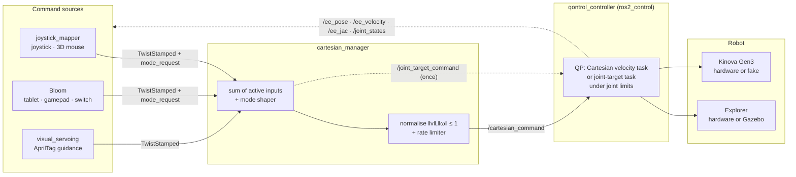

<h1 align="center">Extender</h1>

<p align="center">
  <strong>Pilot a robotic arm to develop the autonomy of disabled people.</strong>
</p>

<p align="center">
  
</p>

<p align="center">
  <a href="#the-project">The Project</a> ·
  <a href="#what-this-organisation-hosts">What We Host</a> ·
  <a href="#how-the-stack-fits-together">Architecture</a> ·
  <a href="#repositories">Repositories</a> ·
  <a href="#robots">Robots</a> ·
  <a href="#quick-start">Quick Start</a> ·
  <a href="#command-contract">Command Contract</a> ·
  <a href="#legacy-architecture">Legacy</a> ·
  <a href="#team">Team</a> ·
  <a href="#contributing">Contributing</a> ·
  <a href="#licensing">Licensing</a> ·
  <a href="#press-and-links">Press</a>
</p>

## The Project

| | |
| --- | --- |
| **Consortium** | [AUCTUS](https://auctus-team.gitlabpages.inria.fr/) @ Inria, [ISIR](https://www.isir.upmc.fr/) @ CNRS, [LAAS](https://www.laas.fr/) @ CNRS, [CETCOPRA](https://cetcopra.pantheonsorbonne.fr/), UCA @ CNRS, [Orthopus](https://orthopus.com/), ESEAN |
| **Funding** | Défi "Transfert robotique", Appel à projets 2023, France 2030 (ANR / BPI France) |
| **Duration** | 2024 – 2027 |

EXTENDER develops interfaces that let people with a motor disability control a
robotic arm mounted on their wheelchair, so they can carry out everyday tasks on
their own. The arm is the **Orthopus Explorer**, and the project transfers
collaborative-robotics know-how from research laboratories to a device meant to
be marketed.

The central challenge is adaptability: solutions must fit each user's
sensory-motor and cognitive abilities. The consortium explores several
interfaces, from tablets and joysticks to smart glasses, augmented-reality
headsets, voice control, and muscle, movement or brain-activity sensors.
Wheelchair users take part throughout, in design, in pre-clinical alpha and beta
tests at ESEAN and Institut Pascal, and at the Cybathlon.

The consortium brings together three robotics laboratories (ISIR, AUCTUS,
LAAS), a start-up from the Handitech France 2030 programme (Orthopus), two
operators for pre-clinical tests (ESEAN APF France handicap and Institut Pascal,
UCA / CNRS), and a research unit on the uses of technology (CETCOPRA, Université
Paris 1 Panthéon-Sorbonne).

## What This Organisation Hosts

`ISIR-EXTENDER` holds the **ROS 2 control stack** that ISIR develops for the
project: the software between an operator's input device and the arm. It is
built so the same code runs on the Orthopus Explorer and on a Kinova Gen3, in
simulation or on hardware, and so that a new interface plugs in as one more
command source rather than a rewrite.

<p align="center">
  
  
  
  
  
</p>

| Layer | What it does | Repository |
| --- | --- | --- |
| **Command sources** | Turn a joystick, a 3D mouse, a tablet, a gamepad, an assistive switch or an AprilTag camera into a Cartesian velocity. | [`input_interfaces`](https://github.com/ISIR-EXTENDER/input_interfaces), [`bloom`](https://github.com/ISIR-EXTENDER/bloom), [`tools`](https://github.com/ISIR-EXTENDER/tools) |
| **Command manager** | Sums every active source, applies the selected control mode, keeps the output bounded and smooth. | [`cartesian_manager`](https://github.com/ISIR-EXTENDER/cartesian_manager) |
| **QP controller** | Turns the Cartesian command into joint motion under joint limits, with the Qontrol QP solver from AUCTUS. | [`qontrol_controller`](https://github.com/ISIR-EXTENDER/qontrol_controller) |
| **Robot** | Explorer hardware and Gazebo simulation from Orthopus; Kinova Gen3 description from Kinova. | external, imported by the workspace |
| **Applications** | The Petanque demonstrator and the operator apps built on the stack. | [`apps-petanque`](https://github.com/ISIR-EXTENDER/apps-petanque), [`bloom`](https://github.com/ISIR-EXTENDER/bloom) |

## How The Stack Fits Together



- **Inputs are summed, not arbitrated.** Every active source publishes a
  unit-scale `geometry_msgs/msg/TwistStamped`; the manager adds them, so a
  joystick and a visual-servoing loop can act together. A source that stops
  streaming for 0.2 s drops out of the sum.
- **Control modes are selected by name** on `/mode_request`: `geometric/both`
  (passthrough), `geometric/jaco` (yaw keeps the tool facing the base),
  `geometric/snake` (the tool axis bends into the direction of travel), and
  `behaviour/joint_target/<pose>` for named poses such as `home`.
- **Control authority stays in the QP.** The manager never moves a joint. A
  named pose is published once as a joint target; `qontrol_controller` turns the
  joint error into a bounded velocity task, so joint limits stay active while
  homing.
- **Frames are explicit.** The rotation part of a command is read in the frame
  its header names: `base_link`, `effector_frame` or `hybrid_frame`. No TF
  lookup. The manager normalises to unit scale; the controller's maximum
  velocities set the real speed.

The full topic and parameter contract is in the
[`cartesian_manager` README](https://github.com/ISIR-EXTENDER/cartesian_manager#readme).

## Repositories

### Active

| Repository | Role | License |
| --- | --- | --- |
| [`extender_workspace`](https://github.com/ISIR-EXTENDER/extender_workspace) | Entry point: `extender.repos` manifest, `setup_workspace.sh`, shared Python environment, build guide, Jazzy migration notes. | Not declared |
| [`cartesian_manager`](https://github.com/ISIR-EXTENDER/cartesian_manager) | Command manager: input summing, `both` / `jaco` / `snake` shapers, named joint targets, normalisation, rate limiting. | Not declared |
| [`qontrol_controller`](https://github.com/ISIR-EXTENDER/qontrol_controller) | `ros2_control` controller on the [Qontrol](https://auctus-team.gitlabpages.inria.fr/components/control/qontrol/index.html) QP solver and Pinocchio. The workspace builds branch `topic/isir_manager`. Private. | GPL-3.0 |
| [`input_interfaces`](https://github.com/ISIR-EXTENDER/input_interfaces) | `joystick_mapper` (joystick and 3D mouse), `visual_servoing` (AprilTag-guided motion), `camera_interface` (gripper camera). | MIT |
| [`tools`](https://github.com/ISIR-EXTENDER/tools) | `apriltag_detector`, `extender_msgs`, `hub` (Arduino I/O bridge), `signal_processing`, `mediapipe_mocap`, `offline_media_publisher`, `dynamic_parameters_identification`. | MIT |
| [`bloom`](https://github.com/ISIR-EXTENDER/bloom) | Operator interface: a builder for accessible robot screens and a kiosk runtime with a latched STOP, connected to the stack through a policy-checked backend. | MIT |
| [`apps-petanque`](https://github.com/ISIR-EXTENDER/apps-petanque) | Petanque demonstrator for the PEPR Robotics programme: bringup, messages, state machine, trajectories. Private. | Not declared |

### Robot descriptions, imported by the workspace

| Repository | Branch | Used for |
| --- | --- | --- |
| [ORTHOPUS-EXPLORER/explorer_stack](https://github.com/ORTHOPUS-EXPLORER/explorer_stack) | `develop` | Explorer description, hardware interface, VESC/CAN drivers, Gazebo simulation, input devices. |
| [Kinovarobotics/ros2_kortex](https://github.com/Kinovarobotics/ros2_kortex) | `jazzy` | `kortex_description` for the Gen3 URDF. Imported with `WITH_KORTEX=1`. |
| [PickNikRobotics/ros2_robotiq_gripper](https://github.com/PickNikRobotics/ros2_robotiq_gripper) | `main` | `robotiq_description` for the 2F-85 gripper. |

### Legacy

Kept readable for the record and for rollback; not a starting point for new
work. See [Legacy architecture](#legacy-architecture) for what these did and how
to run them.

| Repository | What it was |
| --- | --- |
| [`controllers`](https://github.com/ISIR-EXTENDER/controllers) | `ros2_control` controller plugins: `cartesian_velocity`, `kinematic_guides_cartesian_velocity` (shared control), `joint_position_interpolator`, and a snake demo. |
| [`robot_interfaces`](https://github.com/ISIR-EXTENDER/robot_interfaces) | Hardware interface library with Pinocchio kinematics and one Cartesian-velocity interface per robot: Franka, Kinova Gen3, Explorer. |
| [`sandbox_controller`](https://github.com/ISIR-EXTENDER/sandbox_controller) | Lifecycle controller template for new algorithms on the `/teleop_cmd` contract. |
| [`input_interfaces/joystick_interface`](https://github.com/ISIR-EXTENDER/input_interfaces/tree/main/joystick_interface) | Joystick and SpaceMouse to `/teleop_cmd`, replaced by `joystick_mapper`. |
| [`extender_ui`](https://github.com/ISIR-EXTENDER/extender_ui) · [`tablet_interface`](https://github.com/ISIR-EXTENDER/input_interfaces/tree/main/tablet_interface) | The previous tablet app and its websocket backend, tagged `v1.0.0` and `tablet_interface/v1.0.0`. |
| [`ISIR-EXTENDER/explorer_stack`](https://github.com/ISIR-EXTENDER/explorer_stack) | Humble-era fork of the Explorer stack, branch `dev/ts/mode_0`. |

## Robots

| Robot | Role in the project | Simulation | Bringup |
| --- | --- | --- | --- |
| **Orthopus Explorer** | The project's arm, mounted on the wheelchair. Custom assistive arm with CAN/VESC actuators; no slip ring, so continuous wrist rotation is a hard constraint. | Gazebo | `ros2 launch cartesian_manager explorer.launch.py use_simulation:=true` |
| **Kinova Gen3** | Lab reference arm to develop and compare controllers without Explorer's hardware constraints. Robotiq 2F-85 gripper. | `ros2_control` fake hardware | `ros2 launch cartesian_manager kinova.launch.py use_simulation:=true gui:=false` |

The per-robot differences live in configuration, not in duplicated code: one
`cartesian_manager` parameter file and one controller file per arm.

## Quick Start

### 1. Workspace

Ubuntu 24.04 and ROS 2 Jazzy are the baseline. Ubuntu 22.04 with ROS 2 Humble is
retired; the workspace README has an
[upgrade note](https://github.com/ISIR-EXTENDER/extender_workspace#upgrading-from-humble).

```bash
sudo apt install -y build-essential cmake git pkg-config \
  python3-colcon-common-extensions python3-rosdep python3-vcstool libeigen3-dev \
  ros-jazzy-cv-bridge ros-jazzy-image-transport ros-jazzy-apriltag ros-jazzy-apriltag-ros ros-jazzy-usb-cam

mkdir -p ~/workspace/extender && cd ~/workspace/extender
git clone https://github.com/ISIR-EXTENDER/extender_workspace.git
cd extender_workspace

bash setup_workspace.sh              # add WITH_KORTEX=1 for the Kinova stack
uv sync --extra ros-build --extra dev

source /opt/ros/jazzy/setup.bash
rosdep install --from-paths src --ignore-src -r -y
colcon build --symlink-install --packages-up-to cartesian_manager
source install/setup.bash
colcon build --symlink-install
```

### 2. A moving arm

```bash
source install/setup.bash
ros2 launch cartesian_manager explorer.launch.py use_simulation:=true
# or
ros2 launch cartesian_manager kinova.launch.py use_simulation:=true gui:=false
```

Then send a mode request or a named pose:

```bash
ros2 topic pub --once /mode_request std_msgs/msg/String "{data: 'geometric/snake'}"
ros2 topic pub --once /mode_request std_msgs/msg/String "{data: 'behaviour/joint_target/home'}"
```

### 3. Tablet interface

The tablet interface is Bloom. It needs Node.js 24 LTS, npm 11+, Python 3.10 to
3.12 and `uv`. Clone it next to the workspace:

```bash
git clone https://github.com/ISIR-EXTENDER/bloom.git
cd bloom && npm install && (cd backend && uv sync)

# terminal 1: ROS-enabled API
source /opt/ros/jazzy/setup.bash
source ../extender_workspace/install/setup.bash
cd backend && make ros-run

# terminal 2: dashboard
npm run dev
```

Open <http://127.0.0.1:5173>, choose **Runtime**, then **Explorer Manager** or
**Kinova Manager**. The full path from clone to a moving arm is in
[Getting started](https://github.com/ISIR-EXTENDER/bloom/blob/main/docs/tutorials/getting-started.md);
[Operate safely](https://github.com/ISIR-EXTENDER/bloom/blob/main/docs/tutorials/operate-safely.md)
is the operator's page.

<details>
<summary>Known Jazzy caveats</summary>

- `cartesian_manager` installs a `docs` directory that is not committed upstream.
  Create it empty before a clean build.
- Explorer simulation on Jazzy needs two upstream workarounds, documented in the
  [workspace README](https://github.com/ISIR-EXTENDER/extender_workspace#explorer-simulation-on-jazzy):
  stop the standalone `ros2_control_node` once it waits for `robot_description`,
  and bridge the Gazebo clock with `ros_gz_bridge`.
- Machines using Kitware's CMake 4.x need
  `--cmake-args -DCMAKE_POLICY_VERSION_MINIMUM=3.5` on every build.
- For the Kinova, `kortex_description` must come from the `jazzy` branch
  (0.2.6); 0.2.3 and the apt `robotiq_description` fail under Jazzy's
  `ros2_control`.

</details>

> [!CAUTION]
> Start with simulation or fake hardware. Software STOPs latch the command path;
> they do not replace the arm's hardware emergency stop, controller limits, or
> the lab safety procedure. The user sits inside the arm's workspace.

## Command Contract

Everything above the controller speaks this contract. Defaults come from
`cartesian_manager/bringup/config/explorer_params.yaml`.

| Topic | Type | Direction | Meaning |
| --- | --- | --- | --- |
| `/joystick_cartesian_command` | `geometry_msgs/msg/TwistStamped` | in | Joystick, tablet or gamepad twist, unit scale. |
| `/visual_servoing_cartesian_command` | `geometry_msgs/msg/TwistStamped` | in | Visual-servoing twist. |
| `/mode_request` | `std_msgs/msg/String` | in | Mode or behaviour selection. |
| `/cartesian_command` | `geometry_msgs/msg/TwistStamped` | out | Shaped, bounded twist to the QP. |
| `/joint_target_command` | `sensor_msgs/msg/JointState` | out | Named joint target, published once. Empty message cancels. |
| `/ee_pose` · `/ee_velocity` · `/ee_jac` · `/joint_states` | `PoseStamped` · `TwistStamped` · `Float64MultiArray` · `JointState` | feedback | Published by `qontrol_controller`. |

**Modes** are lowercase, `-` becomes `_`, British spelling `behaviour`:

| Request | Effect |
| --- | --- |
| `geometric/both` | Passthrough of the summed twist. Default. |
| `geometric/jaco` | Keeps the translation and replaces the rotation with a yaw rate that keeps the tool facing the base as it moves around it. |
| `geometric/snake` | Adds `gain × (z_tool × v)` to the rotation so the tool axis bends into the direction of travel, like a snake's head. |
| `behaviour/passthrough` | Default behaviour; also cancels an in-flight joint target. |
| `behaviour/joint_target/<name>` | Move to a named pose from the config, once, then return to passthrough. |

**Frames.** `header.frame_id` selects the frame the rotation part is read in:
`base_link` is summed directly, `effector_frame` is rotated into base with the
live `/ee_pose`, `hybrid_frame` uses the manager's hybrid pose. Empty falls back
to `base_link`. There is no TF lookup. The manager normalises output to unit
scale; `command_max_linear_velocity` and `command_max_angular_velocity` in the
controller set the real speed.

**Named poses** are captured from the robot, not typed by hand:

```bash
python3 scripts/capture_joint_target.py boire --merge
```

## Legacy Architecture

Until summer 2026 the stack was built around a family of `ros2_control`
controllers, one per strategy, each running on top of a per-robot hardware
interface:

```text
joystick_interface / tablet_interface (extender_ui)
  -> /teleop_cmd  (extender_msgs/msg/TeleopCommand: twist + mode)
  -> one controller from `controllers` or `sandbox_controller`
  -> robot_interfaces  (FrankaCartesianVelocity, KinovaCartesianVelocity, ExplorerCartesianVelocity)
  -> robot hardware or simulation
```

What worked on that path:

| Capability | Package | Robots |
| --- | --- | --- |
| Cartesian velocity teleoperation with filtering, rate limiting and base/EE frames | `cartesian_velocity` | Franka FR3, Kinova Gen3, Explorer |
| Shared control with kinematic guides: user velocity blended with goal-directed assistance, static and dynamic goals, confidence tracking, RViz markers | `kinematic_guides_cartesian_velocity` | Franka FR3, Kinova Gen3, Explorer |
| Smooth joint-space point-to-point moves on `/joint_position_desired` | `joint_position_interpolator` | Explorer |
| Snake-style teleoperation demo | `cartesian_velocity` (`explorer_snake.launch.py`) | Explorer |
| Template for new algorithms, feedback on `~/ee_pose` and `~/joint_pose` | `sandbox_controller` | Explorer, Kinova Gen3 |
| AprilTag goals feeding shared control through `/shared_control/dynamic_goals` | `apriltag_detector` + `kinematic_guides_cartesian_velocity` | all three |

### Why it changed

We adopted **`qontrol_controller` as the main controller**. Its QP solves for
joint velocities that best follow the commanded twist *while* respecting joint
position and velocity limits, so safety limits are part of the optimisation
rather than a clamp after it. That matters most on the Explorer, where joint
limits and the missing slip ring are hard constraints.

One QP controller per robot made the per-strategy controllers redundant. The
strategies moved one level up, into [`cartesian_manager`](https://github.com/ISIR-EXTENDER/cartesian_manager):
inputs are summed there, modes such as `snake` are shapers there, and named
poses become one-shot joint targets that the QP executes. The contract changed
with it: `/teleop_cmd` with a mode field became `TwistStamped` on
`/joystick_cartesian_command` plus `String` requests on `/mode_request`, and
feedback moved from `/sandbox_controller/*` to `/ee_pose`, `/ee_velocity`,
`/ee_jac` and `/joint_states`.

Shared control with kinematic guides and Franka FR3 support have not been
ported to the new architecture yet.

### Running the legacy flow

The legacy flow targets **Ubuntu 22.04 and ROS 2 Humble**, so use a Humble
machine or container. Workspace revision
[`da55bc9`](https://github.com/ISIR-EXTENDER/extender_workspace/tree/da55bc9)
is the last one whose manifest imports the old repositories.

```bash
git clone https://github.com/ISIR-EXTENDER/extender_workspace.git extender_legacy
cd extender_legacy
git checkout da55bc9
vcs import src < extender.repos --workers 1
uv sync --extra ros-build --extra dev

source /opt/ros/humble/setup.bash
rosdep install --from-paths src --ignore-src -r -y
colcon build --symlink-install --packages-up-to robot_interfaces
source install/setup.bash
colcon build --symlink-install
```

Then pick one controller:

```bash
# Cartesian velocity teleoperation with the joystick
ros2 launch cartesian_velocity explorer_cartesian_velocity_teleop.launch.py can_port:=can0 use_joystick_interface:=true
ros2 launch cartesian_velocity kinova_gen3_teleop_full_bringup.launch.py
ros2 launch cartesian_velocity franka_cartesian_velocity_teleop.launch.py

# Shared control with kinematic guides
ros2 launch kinematic_guides_cartesian_velocity shared_control_explorer.launch.py can_port:=can0
ros2 launch kinematic_guides_cartesian_velocity shared_control_kinova.launch.py

# Sandbox controller, in simulation
ros2 launch sandbox_controller explorer.launch.py use_simulation:=true
```

For the tablet, run the old backend and app, then open **Sandbox V0.0**:

```bash
cd src/input_interfaces/tablet_interface && make run-node   # ws://127.0.0.1:8765/ws/control
cd src/extender-ui && npm install && npm run dev
```

Each package README in [`controllers`](https://github.com/ISIR-EXTENDER/controllers)
lists its parameters and topics.

## Team

**Principal Investigator at ISIR:** Guillaume Morel.

| Name | GitHub | Role |
| --- | --- | --- |
| Susana Sanchez Restrepo | [`@ssrpo`](https://github.com/ssrpo) · [suziesr.xyz](https://suziesr.xyz/) | Maintainer |
| Mégane Millan | [`@MegMll`](https://github.com/MegMll) | Maintainer |
| Etienne Moullet | [`@emoullet`](https://github.com/emoullet) | Contributor |
| Walid Oubraim | [`@woubraim`](https://github.com/woubraim) | Contributor |
| Robin Gibaud | [`@technodroide`](https://github.com/technodroide) | Contributor |

Ask a maintainer for organisation access. Most work needs `extender_workspace`,
`cartesian_manager`, `input_interfaces` and `tools`; controller work also needs
`qontrol_controller`, and the demonstrator needs `apps-petanque`.

## Contributing

<details>
<summary>Branches, commits and pull requests</summary>

- Branch from an up-to-date `main` with a short name: `feat/hybrid-frame`,
  `fix/rate-limiter-reset`, `docs/workspace-onboarding`.
- Commit messages follow [Conventional Commits](https://www.conventionalcommits.org/):
  `feat(cartesian_manager): add hybrid frame`, imperative, lowercase, no period.
- Open a draft PR early. Keep each PR to one logical change and say what changed,
  why, how it was tested, and which robot or simulation assumptions it makes.
- Squash-merge with the PR number in the subject.

</details>

<details>
<summary>Code, documentation and dependencies</summary>

- Write READMEs, comments, PR descriptions and shared docs in English.
- Update the README when adding a topic, a mode, a launch flow, a dependency,
  or a behaviour an operator must understand. Include commands and common
  failure modes.
- Keep robot-specific values in configuration, not in duplicated code.
- Do not add a ROS message type when a generic message works.
- Workspace Python dependencies live in `extender_workspace/pyproject.toml`;
  commit `pyproject.toml` and `uv.lock` together.
- Never commit `build*`, `install*`, `log*`, `.venv/`, `node_modules/`, rosbags,
  camera dumps or machine-specific files.

</details>

<details>
<summary>Validation and robot safety</summary>

```bash
git diff --check
uv lock --locked
colcon build --symlink-install --packages-select <package>
```

- Treat every robot-facing change as safety-sensitive. Make scaling, mode
  changes, enable/disable behaviour and topic names explicit in code and docs.
- Validate in simulation or fake hardware before touching an arm.
- Explorer has no slip ring and runs a QP with hard joint limits. Do not carry
  Kinova assumptions about free rotation onto it.

</details>

## Licensing

| License | Repositories |
| --- | --- |
| MIT | `bloom`, `input_interfaces`, `tools`, `controllers`, `robot_interfaces`, `sandbox_controller` |
| GPL-3.0 | `qontrol_controller` |
| Not declared | `extender_workspace`, `cartesian_manager`, `extender_ui`, `apps-petanque`, `explorer_stack` fork |

Add an explicit `LICENSE` file before reusing or packaging an undeclared
repository outside the project. The external descriptions keep their own
licenses.

## Press And Links

- [Extender at AUCTUS, Inria](https://auctus-team.gitlabpages.inria.fr/projects/extender/), with the project news and integration weeks.
- [ISIR article](https://www.isir.upmc.fr/actualites/controler-un-bras-robot-pour-le-handicap-le-projet-extender-laureat-du-concours-national-dinnovation-en-robotique/) and the [French press release](https://www.isir.upmc.fr/wp-content/uploads/2025/01/le-projet-EXTENDER-laureat-du-Concours-national-dinnovation-en-robotique.pdf).
- [CNRS article](https://www.cnrs.fr/fr/actualite/extender-piloter-un-bras-robotique-pour-developper-lautonomie-des-personnes-en-situation).
- [Sorbonne Université press release](https://www.sorbonne-universite.fr/en/press-releases/extender-project-helping-people-disabilities-operate-robotic-arm), in English.
- [Orthopus](https://orthopus.com/) and the [Explorer stack](https://github.com/ORTHOPUS-EXPLORER).
- [Qontrol](https://auctus-team.gitlabpages.inria.fr/components/control/qontrol/index.html) and [Pinocchio](https://stack-of-tasks.github.io/pinocchio/).

<p align="center">
  <sub>ISIR, Institut des Systèmes Intelligents et de Robotique · Sorbonne Université / CNRS · Paris</sub>
</p>
